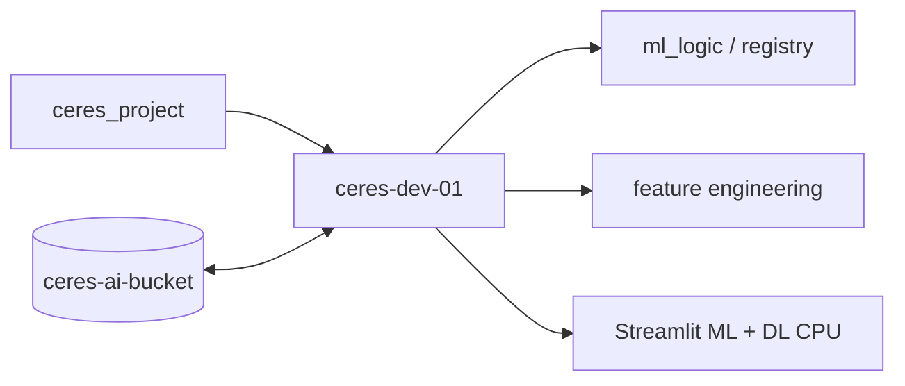

# Ceres GCP — single VM

Team decision: **one CPU VM** for the project (no GPU VM).

## ceres-dev-01

| | |
|--|--|
| **Zone** | `europe-west1-b` |
| **Machine** | `e2-highmem-8` — 8 vCPU, 64 GB RAM |
| **Disk** | 500 GB balanced persistent (boot) |
| **Service account** | `ceres-vm@…` → `gs://ceres-ai-bucket` |
| **SSH** | IAP tunnel only |

This is the largest practical **E2 CPU-only** shape matching “8 cores + 64 GB”. (Standard E2 tops at 32 GB for 8 vCPU; highmem gives 64 GB.)

## Workflow



- **GCS** — durable data  
- **Repo** — recipes on `/opt/ceres/ceres_project`  
- **VM** — all compute (ML sprint + weekend batch on CPU if needed)

## Commands

```bash
gcloud compute ssh ceres-dev-01 --project=ceres-project-498208 --zone=europe-west1-b --tunnel-through-iap
```

Upgrade script: `infra/gcp/upgrade-ceres-vm.sh`

## Quota note

Your `europe-west1` SSD quota is **500 GB** — the boot disk uses the full regional allowance on this one VM. Add a second disk only if you raise the quota.
