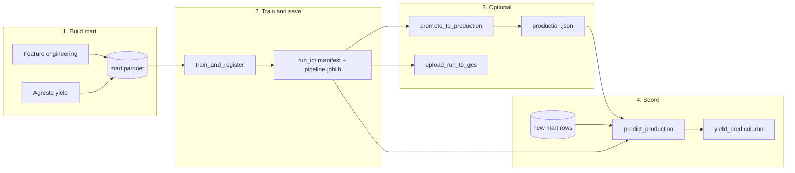

# ML registry — how to use it (team one-pager)

Train a model on a **mart** (dept × harvest year + features + yield), store a **versioned run**, optionally mark it **production**, score new tables later.

Everything stays under `models/registry/` on disk unless you explicitly upload to GCS.

---

## Workflow (visual)



---

## Concepts (4 words each)

| Term | Meaning |
|------|---------|
| **Mart** | Training table: one row per dept × harvest year |
| **Catalog** | `model_specs.py` — `random_forest_default`, `histgb_default`, `lag1`, … |
| **Run** | One experiment folder: metrics + fitted pipeline |
| **Production** | Team-agreed alias in `production.json` |

---

## Mart columns

Your mart must include (names can be patched in FE; registry stores what you pass):

| Column | Role |
|--------|------|
| `DEPT_ID` | Department code |
| `ANNEE` | Harvest year (int) |
| `RENDEMENT` | Target yield (t/ha) |
| *features* | Numeric columns used for training |

The registry does **not** build features — only trains on the mart you provide.

---

## Step 1 — Train and save a run

**You choose the temporal split** (no hidden default in code).

```bash
export LOCAL_REGISTRY_PATH=models/registry   # set before launching Python; use a sandbox to experiment

PYTHONPATH=. python scripts/ml/train_and_register.py \
  --mart data/marts/my_fe_v3.parquet \
  --model-id random_forest_default \
  --features precip_mar meteo_gdd_spring modis_spring_med \
  --train-max-year 2019 \
  --test-min-year 2020
```

Output: `run_id=random_forest_default_YYYYMMDD-HHMMSS` and a folder under `models/registry/`.

**Python:**

```python
import pandas as pd
from ceres_package.ml_logic.train import TemporalSplit, train_and_register

mart = pd.read_parquet("data/marts/my_fe_v3.parquet")
split = TemporalSplit(train_max_year=2019, test_min_year=2020)

run_id = train_and_register(
    mart,
    model_id="random_forest_default",
    feature_cols=["precip_mar", "meteo_gdd_spring", "modis_spring_med"],
    split=split,
    extra_params={"fe_version": "v3", "author": "team"},
)
print(run_id)
```

Holdout metric in `manifest.json`: **`mae`** (t/ha) on test years only.

---

## Step 2 — Inspect runs

```python
from ceres_package.ml_logic.registry import list_runs, load_run

for m in list_runs(model_id="random_forest_default"):
    print(m.run_id, m.metrics, m.params)

loaded = load_run("random_forest_default_20260604-114526")
print(loaded.manifest.feature_cols)
```

---

## Step 3 — Promote (separate, deliberate)

Training does **not** set production. When the team agrees this run is the one to use:

```bash
PYTHONPATH=. python scripts/ml/promote_run.py random_forest_default_20260604-114526
```

```python
from ceres_package.ml_logic.registry import promote_to_production
promote_to_production("random_forest_default_20260604-114526")
```

---

## Step 4 — Score new data

Scoring table needs the **same feature columns** as in the run manifest (plus `DEPT_ID`, `ANNEE`; for `lag1` also needs `RENDEMENT` history).

```python
from ceres_package.ml_logic.predict import predict_production

scored = predict_production(scoring_df, model_id="random_forest_default")
# columns added: yield_pred, model_run_id, model_id
```

Or pin a specific run (no production alias):

```python
from ceres_package.ml_logic.predict import predict
scored = predict(scoring_df, run_id="random_forest_default_20260604-114526")
```

---

## Step 5 — Upload to GCS (optional)

Only if you want the run on the bucket:

```bash
PYTHONPATH=. python scripts/ml/train_and_register.py ... --upload-gcs
```

Or after the fact:

```python
from ceres_package.ml_logic.registry import upload_run_to_gcs
upload_run_to_gcs(run_id)
```

---

## Add a new model type

Edit **`ceres_package/ml_logic/model_specs.py`** only:

1. Add `def _my_pipeline() -> Pipeline: ...`
2. Add one `ModelSpec(..., kind="sklearn", build_pipeline=_my_pipeline)` to `MODEL_CATALOG`.

No change to `registry.py` or `train.py`.

---

## Rollback

| Goal | Action |
|------|--------|
| Stop using a run in prod | Edit `models/registry/production.json` |
| Delete an experiment | `rm -rf models/registry/<run_id>/` |
| Safe sandbox | `export LOCAL_REGISTRY_PATH=demo/my_sandbox/registry` |

`models/registry/` is **gitignored**.

---

## QA — “I built a new FE mart; how do I train and store?”

**Situation:** You finished feature engineering and have `mart_fe_v4.parquet` (new columns). You want a stored Random Forest (or other catalog model) for comparison and later scoring.

### A. Prepare the mart

1. One row per **`DEPT_ID` × `ANNEE`** (harvest year).
2. Columns: `DEPT_ID`, `ANNEE`, `RENDEMENT`, plus numeric features.
3. Save e.g. `data/marts/mart_fe_v4.parquet`.

### B. Train and register

```python
import pandas as pd
from ceres_package.ml_logic.train import TemporalSplit, train_and_register

mart = pd.read_parquet("data/marts/mart_fe_v4.parquet")

FEATURES = [
    "col_from_your_fe_1",
    "col_from_your_fe_2",
    # list every column the model should see
]

split = TemporalSplit(train_max_year=2019, test_min_year=2020)

run_id = train_and_register(
    mart,
    model_id="random_forest_default",
    feature_cols=FEATURES,
    split=split,
    extra_params={"fe_version": "v4", "notes": "meteo spring + RPG NDVI"},
)
print("Saved:", run_id)
```

Or CLI:

```bash
PYTHONPATH=. python scripts/ml/train_and_register.py \
  --mart data/marts/mart_fe_v4.parquet \
  --model-id random_forest_default \
  --features col_from_your_fe_1 col_from_your_fe_2 \
  --train-max-year 2019 \
  --test-min-year 2020
```

### C. Check the run

```python
from ceres_package.ml_logic.registry import load_run

m = load_run(run_id).manifest
assert m.feature_cols == FEATURES
print("Holdout MAE:", m.metrics["mae"])
print("Split:", m.params["train_max_year"], m.params["test_min_year"])
```

### D. (Optional) Set as production model

```python
from ceres_package.ml_logic.registry import promote_to_production
promote_to_production(run_id)
```

### E. Score another table with the same features

```python
from ceres_package.ml_logic.predict import predict

score_df = pd.read_parquet("data/marts/mart_fe_v4_scoring.parquet")
out = predict(score_df, run_id=run_id)
out[["DEPT_ID", "ANNEE", "RENDEMENT", "yield_pred"]].head()
```

### F. Compare two FE versions

Train twice with different marts / feature lists → two `run_id`s → compare `manifest.metrics["mae"]` via `list_runs()`. Promote only the winner.

---

## What this is not

- **Not** LOGO cross-validation (single temporal holdout per run).
- **Not** hyperparameter search (use notebooks; see legacy `ml_pipeline.py`).
- **Not** feature engineering (upstream of the mart).

---

## Sandbox test

Use a dedicated `LOCAL_REGISTRY_PATH` (e.g. `/tmp/registry_smoke`) and a small mart parquet so production `models/registry/` is untouched.
